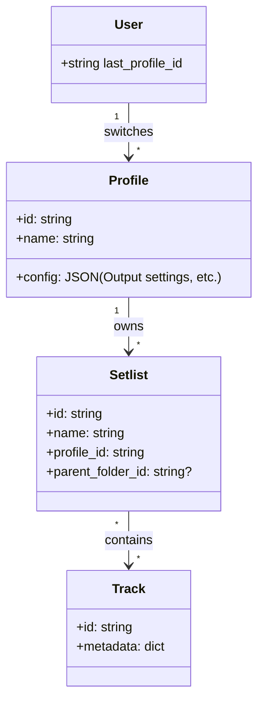

# EasyMusic: Future Feature Specifications

This document outlines the detailed requirements, database schemas, and user stories for the upcoming features of the EasyMusic application.

---

## 1. Profile & Library Management

### Requirements
- **Integrated Profile System**: Profiles are managed directly within the existing `playlist.json` / `setlists.json` structure or via new tables in the existing SQLite database.
- **Dedicated Playlists**: Every profile has its own set of playlists and folder structures.
- **Profile Selection Menu**: A dropdown or sidebar menu accessible from all views (Home, Virtual DJ, Chat) to switch active profiles.
- **"Master" Profile**: A hardcoded system profile that has a read-only view of ALL tracks in the database.
- **Profile CRUD**: Full UI support for adding, renaming, and deleting profiles. Deleting a profile will optionally prompt to delete its specific playlists.

### UML Architecture


### Technical Implementation Details
- **Existing DB Extension**: Add a `profile_id` field to the `Setlist` model in `backend/models.py`.
- **Global Profile State**: Implement a `ProfileProvider` in React to wrap the entire app.
  - `const { activeProfile, switchProfile } = useProfile();`
- **Backend Filter**: Every track/playlist fetch request must include `?profile_id=...` to ensure data isolation.
- **Profile Menu**: A sleek, animated dropdown in the header with:
  - List of available profiles.
  - "Add New Profile" button.
  - Settings cog next to each profile name for editing.

### Acceptance Criteria (AC)
- [ ] User can click the profile name in the header to open a selection menu.
- [ ] Selecting a new profile updates the entire application's data without a full page refresh.
- [ ] Existing songs/playlists are automatically assigned to a "Default" profile during the migration.
- [ ] The "Master" profile correctly aggregates tracks from all other profiles.

---

## 2. Advanced Organization View (Library Manager)

### Requirements
- **3-Panel Layout**:
  - **Pane 1 (Left)**: Folder Hierarchy (Categories).
  - **Pane 2 (Center)**: Setlists/Playlists within the selected category.
  - **Pane 3 (Right)**: Tracks within the selected Setlist.
- **Drag-and-Drop Across Panes**: Move tracks from Right to Center, or Center to Left.
- **Context-Shared State**: Modern React state management to sync changes across the sidebar, the main player, and the library manager.
- **Real-time Backend Sync**: Every drag-and-drop action immediately triggers a background API call to update the database.

### Technical Implementation Details
- **Library Manager View**: A dedicated route (`/library-manager`) using a CSS Grid or Flexbox layout for the 3 panels.
- **LibraryContext API**: 
  ```javascript
  const LibraryContext = createContext();
  // Provides: folders, setlists, tracks, dispatchAction({type: 'MOVE_TRACK', ...})
  ```
- **Backend API Endpoints**:
  - `PATCH /api/folders/:id`: Update name or parent_id.
  - `PATCH /api/setlists/:id`: Update category_id or tracks order.
  - `POST /api/library/reorganize`: Batch move multiple items in one transaction.
- **Optimistic UI**: Update the UI state immediately and revert if the backend request fails (showing a toast notification).

### Acceptance Criteria (AC)
- [ ] Users can navigate to the "Library Manager" via a new menu item.
- [ ] Dragging a track from the rightmost panel to a playlist in the center panel adds it to that playlist.
- [ ] Dragging a playlist to a different category folder in the leftmost panel correctly reassigns its category.
- [ ] Deleting a category folder in Pane 1 prompts the user: "Archive or Delete all playlists inside?".
- [ ] The Library Manager layout is responsive and provides a clear "active" state for the currently selected folder/playlist.

---

## 3. AI Chatbot Music Editing & Reorganization

### Requirements
- **Advanced Reorganization Commands**: The bot should handle structural changes.
  - *Example*: "Simplify the folder structure by moving all sub-folders of 'Film' into a single 'Movie Soundtrack' category."
  - *Example*: "Move all tracks currently in the root into a new folder called 'Unsorted'."
- **Tag & Category Intelligence**: The bot can suggest and apply tags based on song titles or existing metadata.
  - *Example*: "Find all songs about 'Rain' and tag them as 'Melancholy'."
- **Future Capabilities**: 
  - Automated playlist generation based on mood analysis.
  - Deep-scanning of library to find duplicate tracks and offering a "Merge" command.

### New Tool-Call Signatures
To support complex reorganization, Gemini will be provided with:
- `get_library_hierarchy()`: Returns a full JSON tree of all categories, folders, and setlists.
- `batch_reorganize(plan)`: Takes a list of move operations (e.g., `{"move": "folderX", "to": "folderY"}`).
- `update_category_bulk(filter, new_category)`: Changes the category for all matching tracks/setlists.
- `query_tags_availability()`: Returns a list of all unique tags currently used in the DB.

### Technical Implementation Details
- **Command Preview**: For structure-changing commands, the bot generates a "Change Plan" (JSON) and the UI displays a "Preview Changes" modal to the user.
- **Undo History**: Each `batch_reorganize` call creates a restore point.
- **Fuzzy Matching**: The backend uses libraries like `thefuzz` to resolve folder name mentions in chat.

### Acceptance Criteria (AC)
- [ ] Asking "Move all my techno songs to the 'Electronic' folder" correctly identifies both the tracks (via tags) and the target folder.
- [ ] Asking "Simplify my library" triggers a `get_library_hierarchy` call and returns a proposed flattened structure.
- [ ] The chatbot can list all folders in a specific category when asked: "What's inside the 'Soundtrack' category?".
- [ ] Commands like "Rename 'Old Folder' to 'Archived'" work instantly in the sidebar via the shared `LibraryContext`.

---

## 4. Enhanced Backend Logic & Logging

### Requirements
- **Download Logging**: All `yt-dlp` or download service actions must be logged.
- **Matching Script**: A Python utility to scan a local folder and match files to the database.
  - **Parsing Logic**: `Title - Author - Tag1, Tag2.mp3`
  - **Path Logic**: The category is determined by the folder path relative to the root.

### Technical Implementation Details
- **Log Format**: Structured JSON logs in `backend/logs/downloads.log` for easy parsing. Format: `{"timestamp": "...", "event": "download_start", "track_id": "...", "status": "success/fail"}`.
- **Matching Script Regex**: `^(?P<title>.+?) - (?P<author>.+?) - (?P<tags>.+)\.(?P<ext>mp3|wav)$`.
- **Deduplication**: Before importing, the script hashes the file and checks against existing `local_file` paths and hashes in the database to prevent duplicates.
- **Folder Root**: The script takes a `--root` argument (e.g., `C:\Downloads`) and calculates categories relative to this root using `os.path.relpath`.

### Acceptance Criteria (AC)
- [ ] Every download attempt creates an entry in the log file.
- [ ] The matching script correctly identifies "Song A - Artist X - Tag1, Tag2.mp3" and maps it to the corresponding DB fields.
- [ ] Files imported via the script appear in the library with the correct "Category" based on their folder structure.
- [x] Legacy Import: A script exists to import all music from `C:\Users\xam74\PycharmProjects\LaBriqueMusique\completed`, updating both the database and the file metadata (Artist, Tag, Category).
- [ ] The script provides a summary at the end: "X files matched, Y files new, Z files skipped".

---

## 5. Download Metadata & Structure

### Requirements
- **File Naming Convention**: All downloads must follow: `{Title} - {Author} - {Tags}.mp3`.
- **ID3 Tagging**: The backend must embed metadata into the MP3 file.
- **Mirroring Folders**: The local storage should reflect the library's category/folder structure.

### Technical Implementation Details
- **Library for Tagging**: Use `mutagen` (Python) to write ID3v2.4 tags.
- **Tag Mapping**:
  - `TIT2` (Title) -> {Title}
  - `TPE1` (Lead performer) -> {Author}
  - `TCON` (Content type/Tags) -> Joined strings of {Tags}
  - `COMM` (Comments) -> {YouTube URL}
- **Filename Sanitization**: Use `pathvalidate` or similar to strip invalid NTFS characters (e.g., `:`, `?`, `*`) from filenames.
- **Folder Sync**: If a track is moved to a new folder in the UI, the backend should optionally move the corresponding `.mp3` file to the new relative path.

### Acceptance Criteria (AC)
- [ ] A downloaded file has the exact name "Title - Author - Tag1, Tag2.mp3".
- [ ] Opening the file in VLC or Windows Media Player shows the correct Author and Title in the metadata.
- [ ] The file is saved in a subfolder corresponding to its Category (e.g., `downloads/Pop/Upbeat/`).

---

## 6. Audio Output Selection

### Requirements
- **Per-Track Output**: Each track in the player or list view should have a dropdown to select the audio output device.
- **Device Detection**: The application automatically detects all available system audio outputs.

### Technical Implementation Details
- **Web Audio API**: Use `HTMLMediaElement.setSinkId(deviceId)`. Note: This requires a secure context (HTTPS/localhost).
- **Device Enumeration**: Call `navigator.mediaDevices.enumerateDevices()` and filter for `kind: 'audiooutput'`.
- **Persistence**: Store the `sinkId` for the local session. If a device is unplugged, fall back to the "Default" system output.
- **UI Component**: A small speaker icon next to each track that opens a device selection menu.

### Acceptance Criteria (AC)
- [ ] The output dropdown lists all connected speakers and headphones.
- [ ] Selecting "Headphones" for a track routes that specific audio stream only to the headphones.
- [ ] The application handles cases where no secondary output device is available by showing "Default Only".

---

## 7. Performance & Filtering

### Requirements
- **Optimized MP3 Loading**: Improve performance when opening large files or lists.
- **Tag Filtering**: Search bar searches within tags.
- **UI Clarification**: Change "string" links to "**Play from YouTube**".

### Technical Implementation Details
- **Virtual Lists**: Use `react-window` or `react-virtuoso` for the track list to handle thousands of items without lag.
- **Audio Waveform Caching**: Generate waveform data once and cache it (e.g., in indexedDB or as a small `.json` sibling to the `.mp3`) to avoid re-calculating on every load.
- **Search Indexing**: Use `FlexSearch` or simple pre-processed lowercase strings for tags to allow instant filtering across 1000+ tracks.
- **String Replacement**: Locate all instances of the hardcoded "string" placeholder in `Playlist.jsx` or similar components and replace with the new label.

### Acceptance Criteria (AC)
- [ ] Searching for a tag (e.g., "Epic") instantly filters the list (under 50ms for 1000 tracks).
- [ ] Scrolling through a list of 500+ tracks remains smooth at 60fps.
- [ ] Audio waveforms appear in under 1 second for a 5-minute song after the first load.
- [ ] The text "Play from YouTube" is clearly visible for all YouTube-sourced tracks.
